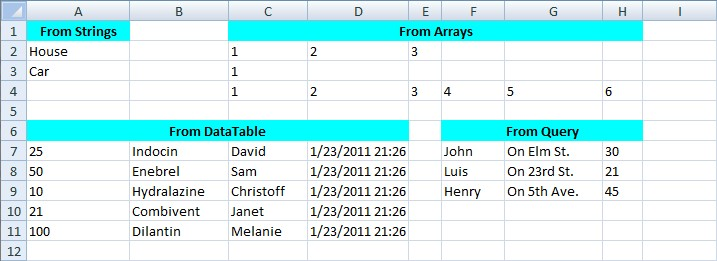

This example shows how to insert data into a worksheet by using the method cell.InsertData(collection)  
**Note:** The difference between InsertData and InsertTable is that InsertData doesn't insert column names and returns a range. InsertTable will insert the column names and returns a table.  

  

```c#
public void Create()
{
  var wb = new XLWorkbook();
  var ws = wb.Worksheets.Add("Inserting Data");

  // From a list of strings
  var listOfStrings = new List<String>();
  listOfStrings.Add("House");
  listOfStrings.Add("Car");
  ws.Cell(1, 1).Value = "From Strings";
  ws.Cell(1, 1).AsRange().AddToNamed("Titles");
  var rangeWithStrings = ws.Cell(2, 1).InsertData(listOfStrings);

  // From a list of arrays
  var listOfArr = new List<Int32[]>();
  listOfArr.Add(new Int32[] { 1, 2, 3 });
  listOfArr.Add(new Int32[] { 1 });
  listOfArr.Add(new Int32[] { 1, 2, 3, 4, 5, 6 });
  ws.Cell(1, 3).Value = "From Arrays";
  ws.Range(1, 3, 1, 8).Merge().AddToNamed("Titles");
  var rangeWithArrays = ws.Cell(2, 3).InsertData(listOfArr);

  // From a DataTable
  var dataTable = GetTable();
  ws.Cell(6, 1).Value = "From DataTable";
  ws.Range(6, 1, 6, 4).Merge().AddToNamed("Titles");
  var rangeWithData = ws.Cell(7, 1).InsertData(dataTable.AsEnumerable());

  // From a query
  var list = new List<Person>();
  list.Add(new Person() { Name = "John", Age = 30, House = "On Elm St."   });
  list.Add(new Person() { Name = "Mary", Age = 15, House = "On Main St."  });
  list.Add(new Person() { Name = "Luis", Age = 21, House = "On 23rd St."  });
  list.Add(new Person() { Name = "Henry", Age = 45, House = "On 5th Ave." });

  var people = from p in list
    where p.Age >= 21
    select new { p.Name, p.House, p.Age };

  ws.Cell(6, 6).Value = "From Query";
  ws.Range(6, 6, 6, 8).Merge().AddToNamed("Titles");
  var rangeWithPeople = ws.Cell(7, 6).InsertData(people.AsEnumerable());

  // Prepare the style for the titles
  var titlesStyle = wb.Style;
  titlesStyle.Font.Bold = true;
  titlesStyle.Alignment.Horizontal = XLAlignmentHorizontalValues.Center;
  titlesStyle.Fill.BackgroundColor = XLColor.Cyan;

  // Format all titles in one shot
  wb.NamedRanges.NamedRange("Titles").Ranges.Style = titlesStyle;

  ws.Columns().AdjustToContents();

  wb.SaveAs("InsertingData.xlsx");
}

class Person
{
  public String House { get; set; }
  public String Name { get; set; }
  public Int32 Age { get; set; }
}

private DataTable GetTable()
{
  DataTable table = new DataTable();
  table.Columns.Add("Dosage", typeof(int));
  table.Columns.Add("Drug", typeof(string));
  table.Columns.Add("Patient", typeof(string));
  table.Columns.Add("Date", typeof(DateTime));

  table.Rows.Add(25, "Indocin", "David", DateTime.Now);
  table.Rows.Add(50, "Enebrel", "Sam", DateTime.Now);
  table.Rows.Add(10, "Hydralazine", "Christoff", DateTime.Now);
  table.Rows.Add(21, "Combivent", "Janet", DateTime.Now);
  table.Rows.Add(100, "Dilantin", "Melanie", DateTime.Now);
  return table;
}
```
