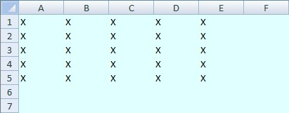
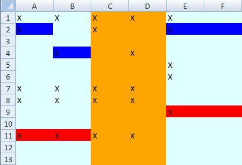

## Inserting Rows

**Create a new worksheet and fill some cells**  
```c#
var workbook = new XLWorkbook();
var ws = workbook.Worksheets.Add("Inserting Rows");

// Color the entire spreadsheet using rows
ws.Rows().Style.Fill.BackgroundColor = XLColor.LightCyan;

// Put a value in a few cells
foreach (var r in Enumerable.Range(1, 5))
  foreach (var c in Enumerable.Range(1, 5))
    ws.Cell(r, c).Value = "X";
```

  

**Now let's play inserting rows to the worksheet and ranges**  
```c#
var blueRow = ws.Row(2);
var redRow = ws.Row(5);

blueRow.Style.Fill.BackgroundColor = XLColor.Blue;
blueRow.InsertRowsBelow(2);

redRow.Style.Fill.BackgroundColor = XLColor.Red;
redRow.InsertRowsAbove(2);

ws.Columns(3, 4).Style.Fill.BackgroundColor = XLColor.Orange;
ws.Range("A2:A4").InsertRowsBelow(2);
ws.Range("B2:B4").InsertRowsAbove(2);
ws.Range("C2:C4").InsertRowsBelow(2);
ws.Range("D2:D4").InsertRowsAbove(2);

workbook.SaveAs("InsertingRows.xlsx");
```


