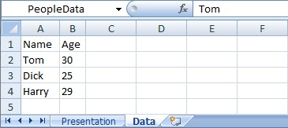
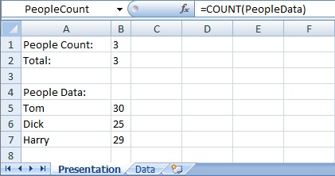

## Named Ranges

  

  

```c#
var wb = new XLWorkbook();
var wsPresentation = wb.Worksheets.Add("Presentation");
var wsData = wb.Worksheets.Add("Data");

// Fill up some data
wsData.Cell(1, 1).Value = "Name";
wsData.Cell(1, 2).Value = "Age";
wsData.Cell(2, 1).Value = "Tom";
wsData.Cell(2, 2).Value = 30;
wsData.Cell(3, 1).Value = "Dick";
wsData.Cell(3, 2).Value = 25;
wsData.Cell(4, 1).Value = "Harry";
wsData.Cell(4, 2).Value = 29;

// Create a named range with the data:
wsData.Range("A2:B4").AddToNamed("PeopleData"); // Default named range scope is Workbook

// Let's use the named range in a formula:
wsPresentation.Cell(1, 1).Value = "People Count:";
wsPresentation.Cell(1, 2).FormulaA1 = "COUNT(PeopleData)";

// Create a named range with worksheet scope:
wsPresentation.Range("B1").AddToNamed("PeopleCount", XLScope.Worksheet);

// Let's use the named range:
wsPresentation.Cell(2, 1).Value = "Total:";
wsPresentation.Cell(2, 2).FormulaA1 = "PeopleCount";

// Copy the data in a named range:
wsPresentation.Cell(4, 1).Value = "People Data:";
wsPresentation.Cell(5, 1).Value = wb.Range("PeopleData");

/////////////////////////////////////////////////////////////////////////
// For the Excel geeks out there who actually know about
// named ranges with relative addresses, you can
// create such a thing with the following methods:

// The following creates a relative named range pointing to the same row
// and one column to the right. For example if the current cell is B4
// relativeRange1 will point to C4.
wsPresentation.NamedRanges.Add("relativeRange1", "Presentation!B1");

// The following creates a ralative named range pointing to the same row
// and one column to the left. For example if the current cell is D2
// relativeRange2 will point to C2.
wb.NamedRanges.Add("relativeRange2", "Presentation!XFD1");

// Explanation: The address of a relative range always starts at A1
// and moves from then on. To get the desired relative range just
// add or subtract the required rows and/or columns from A1.
// Column -1 = XFD, Column -2 = XFC, etc.
// Row -1 = 1048576, Row -2 = 1048575, etc.
/////////////////////////////////////////////////////////////////////////

wsData.Columns().AdjustToContents();
wsPresentation.Columns().AdjustToContents();

wb.SaveAs("NamedRanges.xlsx");
```
