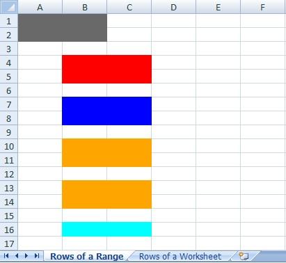
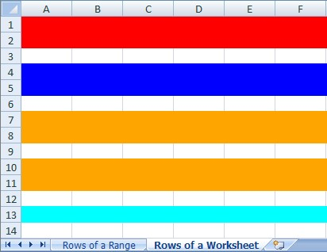

## Selecting Rows of a Range

  

```c#
var workbook = new XLWorkbook();
var ws = workbook.Worksheets.Add("Rows of a Range");

// All rows in a range
ws.Range("A1:B2").Rows().Style.Fill.BackgroundColor = XLColor.DimGray;

var bigRange = ws.Range("B4:C17");

// Contiguous rows by number
bigRange.Rows(1, 2).Style.Fill.BackgroundColor = XLColor.Red;

// Contiguous rows by number
bigRange.Rows("4:5").Style.Fill.BackgroundColor = XLColor.Blue;

// Spread rows by number
bigRange.Rows("7:8,10:11").Style.Fill.BackgroundColor = XLColor.Orange;

// Using a single number
bigRange.Rows("13").Style.Fill.BackgroundColor = XLColor.Cyan;

// Only the used rows in a worksheet
ws.Rows().Height = 15;
```

## Selecting Rows in a Worksheet

  

```c#
var ws2 = workbook.Worksheets.Add("Rows of a Worksheet");

// Contiguous rows by number
ws2.Rows(1, 2).Style.Fill.BackgroundColor = XLColor.Red;

// Contiguous rows by number
ws2.Rows("4:5").Style.Fill.BackgroundColor = XLColor.Blue;

// Spread rows by number
ws2.Rows("7:8,10:11").Style.Fill.BackgroundColor = XLColor.Orange;

// Using a single number
ws2.Rows("13").Style.Fill.BackgroundColor = XLColor.Cyan;

ws2.Rows("1:13").Height = 15;

workbook.SaveAs("SelectingRows.xlsx");
```
