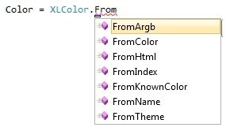
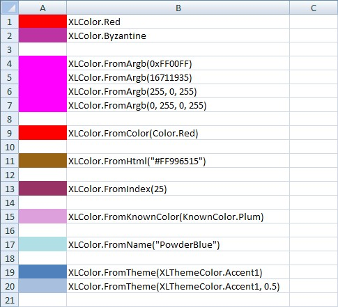

You can create XLColor objects in a variety of ways. You can select one of the many [ClosedXML Predefined Colors](ClosedXML-Predefined-Colors), or you can create your own with one of the following methods:  

  

Here's an example on how to work with colors:  

  

```c#
var wb = new XLWorkbook();
var ws = wb.Worksheets.Add("Using Colors");

Int32 ro = 0;

// From Known color
ws.Cell(++ro, 1).Style.Fill.BackgroundColor = XLColor.Red;
ws.Cell(ro, 2).Value = "XLColor.Red";

// From Color not so known
ws.Cell(++ro, 1).Style.Fill.BackgroundColor = XLColor.Byzantine;
ws.Cell(ro, 2).Value = "XLColor.Byzantine";

ro++;

// FromArgb(Int32 argb) using Hex notation
ws.Cell(++ro, 1).Style.Fill.BackgroundColor = XLColor.FromArgb(0xFF00FF);
ws.Cell(ro, 2).Value = "XLColor.FromArgb(0xFF00FF)";

// FromArgb(Int32 argb) using an integer (you need to convert the hex value to an int)
ws.Cell(++ro, 1).Style.Fill.BackgroundColor = XLColor.FromArgb(16711935);
ws.Cell(ro, 2).Value = "XLColor.FromArgb(16711935)";

// FromArgb(Int32 r, Int32 g, Int32 b)
ws.Cell(++ro, 1).Style.Fill.BackgroundColor = XLColor.FromArgb(255, 0, 255);
ws.Cell(ro, 2).Value = "XLColor.FromArgb(255, 0, 255)";

// FromArgb(Int32 a, Int32 r, Int32 g, Int32 b)
// Note: Excel ignores the alpha value
ws.Cell(++ro, 1).Style.Fill.BackgroundColor = XLColor.FromArgb(0, 255, 0, 255);
ws.Cell(ro, 2).Value = "XLColor.FromArgb(0, 255, 0, 255)";

ro++;

// FromColor(Color color)
ws.Cell(++ro, 1).Style.Fill.BackgroundColor = XLColor.FromColor(Color.Red);
ws.Cell(ro, 2).Value = "XLColor.FromColor(Color.Red)";

ro++;

// FromHtml(String htmlColor)
ws.Cell(++ro, 1).Style.Fill.BackgroundColor = XLColor.FromHtml("#FF996515");
ws.Cell(ro, 2).Value = "XLColor.FromHtml(\"#FF996515\")";

ro++;

// FromIndex(Int32 indexedColor)
ws.Cell(++ro, 1).Style.Fill.BackgroundColor = XLColor.FromIndex(25);
ws.Cell(ro, 2).Value = "XLColor.FromIndex(25)";

ro++;

// FromKnownColor(KnownColor knownColor)
ws.Cell(++ro, 1).Style.Fill.BackgroundColor = XLColor.FromKnownColor(KnownColor.Plum);
ws.Cell(ro, 2).Value = "XLColor.FromKnownColor(KnownColor.Plum)";

ro++;

// FromName(String colorName)
ws.Cell(++ro, 1).Style.Fill.BackgroundColor = XLColor.FromName("PowderBlue");
ws.Cell(ro, 2).Value = "XLColor.FromName(\"PowderBlue\")";

ro++;

// From Theme color
ws.Cell(++ro, 1).Style.Fill.BackgroundColor = XLColor.FromTheme(XLThemeColor.Accent1);
ws.Cell(ro, 2).Value = "XLColor.FromTheme(XLThemeColor.Accent1)";

// From Theme color with tint
ws.Cell(++ro, 1).Style.Fill.BackgroundColor = XLColor.FromTheme(XLThemeColor.Accent1, 0.5);
ws.Cell(ro, 2).Value = "XLColor.FromTheme(XLThemeColor.Accent1, 0.5)";

ws.Columns().AdjustToContents();

wb.SaveAs("UsingColors.xlsx");
```
