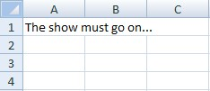
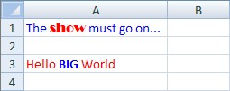
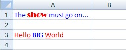

```c#
var wb = new XLWorkbook();
var ws = wb.Worksheets.Add("Rich Text");
```

**Let's start with a plain text and then decorate it...**  
```c#
var cell1 = ws.Cell(1, 1).SetValue("The show must go on...");
```

  

**We want everything in blue except the word show (which we want in red and with Broadway Font)**  
```c#
cell1.Style.Font.FontColor = XLColor.Blue; // Set the color for the entire cell
cell1.RichText.Substring(4, 4)
  .SetFontColor(XLColor.Red)
  .SetFontName("Broadway"); // Set the color and font for the word "show"
```

  

**On the next example we'll start with an empty cell and add the rich text**  
```c#
var cell = ws.Cell(3, 1);

// Add the text parts
cell.RichText
  .AddText("Hello").SetFontColor(XLColor.Red)
  .AddText(" BIG ").SetFontColor(XLColor.Blue).SetBold()
  .AddText("World").SetFontColor(XLColor.Red);
```

  

**Here we're showing that even though we added three pieces of text you can treat them like a single one.**  
```c#
cell.RichText.Substring(4, 7).SetUnderline();
```

  

**Right now cell.RichText has the following 5 strings:**

1.  "Hell" -> Red
2.  "o" -> Red, Underlined
3.  " BIG " -> Blue, Underlined, Bold
4.  "W" -> Red, Underlined
5.  "orld" -> Red

**Of course you can loop through each piece of text and check its properties:**  
```c#
foreach (var richText in cell.RichText)
{
  if(richText.Bold)
  ws.Cell(3, 2).Value = String.Format("\"{0}\" is Bold.", richText.Text);
}
```

  

```c#
ws.Columns().AdjustToContents();

wb.SaveAs("UsingRichText.xlsx");
```
